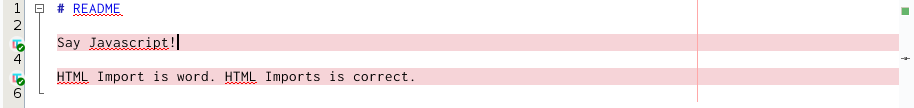
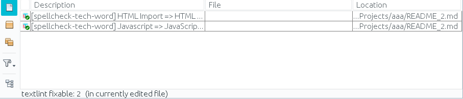

## NetBeans textlint Plugin

[](https://opensource.org/licenses/Apache-2.0) [](https://travis-ci.org/junichi11/netbeans-textlint-plugin)

This plugin provides support for textlint.



### What's the textlint?

See https://github.com/textlint/textlint

### Downloads

- https://github.com/junichi11/netbeans-textlint-plugin/releases

### Usage

#### Install textlint and rules

Of course, it assumes that nodejs and npm are installed.

e.g.

```
$ mkdir txtlint
$ cd txtlint
$ npm init
$ npm install textlint --save-dev
$ npm install textlint-rule-max-ten textlint-rule-spellcheck-tech-word textlint-rule-no-mix-dearu-desumasu --save-dev
```

#### Create .textlintrc

```
$ touch .textlintrc
```

```json
{
  "rules": {
    "max-ten": {
      "max": 3
    },
    "spellcheck-tech-word": true,
    "no-mix-dearu-desumasu": true
  }
}
```

You can also set parameters to Options (see below).

#### Set textlint and .textlintrc paths

Set paths to the Options (see below).

e.g.

- textlint Path: /path/to/txtlint/node_modules/.bin/textlint (textlint.cmd in Windows)
- .textlintrc Path: /path/to/textlint/.textlintrc

#### Open Action Items window

- Click Window > Action Items.
- Click "Show action items for currently edited file only" icon.
- Open your markdown or text file.



### Options

Tools > Options > Editor > textlint

- textlint Path: Absolute path to textlint
- .textlintrc Path: Absolute path to .textlintrc
- Options : You can set options for the textlint command
- Enable in HTML files: To use the html plugin, you can check this
- Refresh on Save: To scan the document on save, you can check this (Checked by default)
- Show Annotations: To show annotations in the glyph gutter, you can check this (Checked by default)

### Actions

#### Fix

You have to save your file before you run this action.
If there is a fixable rule's error, you can fix it. Right-click an item > Click `Fix`.
To refresh items, your document is saved once.

#### Fix All

You have to save your file before you run this action.
If there are fixable rule's errors, you can fix them. Right-click an item > Click `Fix All`.
This action runs `textlint --fix`command.

### NOTE

- The plugin scans only current file.
- The plugin does not refresh if your file has modifications. Please save it.
- Use `UTF-8` as file encoding and `LF` as line endings.
- This plugin may not work properly in Windows. (Please try to check above.)
- If you cannot get expected results, just try to run the `textlint` commands once in your CLI.
